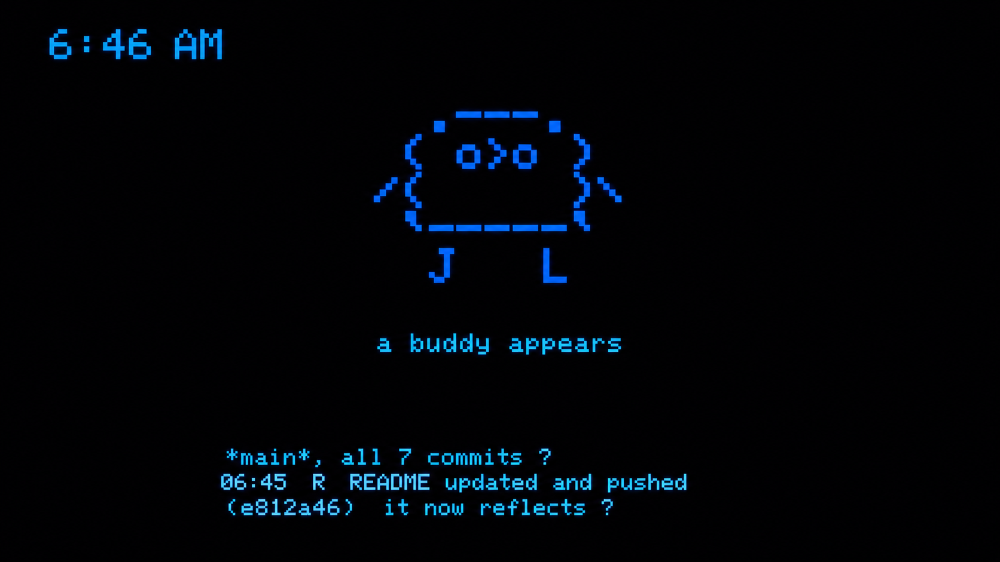

# Claude Pet 🐾



A desk pet on an ESP32-S3 touchscreen that reacts to **Claude Code** in real time —
it sleeps when you're idle, gets busy when Claude is working, demands attention when a
permission prompt is pending, and lets you **approve or deny tool calls by swiping the prompt
card — right to approve, left to deny** (Tinder-style, tilt and all).

Built by porting two MIT-licensed open-source projects to the
**Freenove FNK0104B** (ESP32-S3 Display 2.8" Touch, "CYD"-style):

- **Firmware:** fork of [anthropics/claude-desktop-buddy](https://github.com/anthropics/claude-desktop-buddy) —
  the official 7-state pet (18 ASCII species + GIF character packs), retargeted from the
  M5StickC Plus to this board's ILI9341 240×320 panel + FT6336G capacitive touch.
- **Host bridge:** fork of [SnowWarri0r/cc-buddy-bridge](https://github.com/SnowWarri0r/cc-buddy-bridge) —
  Claude Code CLI hooks → Unix socket → daemon, extended with a **USB CDC serial transport**
  (`serial_transport.py`) replacing BLE, since the board sits on USB anyway.

```
Claude Code CLI ─hooks→ unix socket → bridge daemon ─NDJSON over USB serial→ ESP32-S3
   └─ JSONL tailer (tokens, transcript entries) ┘        pet state machine + touch UI
```

## Hardware (Freenove FNK0104B)

| Part | Detail |
|---|---|
| MCU | ESP32-S3, 16MB QIO flash, 8MB OPI PSRAM, native USB-Serial/JTAG |
| LCD | ILI9341(V) 240×320 SPI — MOSI 11 / SCLK 12 / CS 10 / DC 46, backlight GPIO45 (PWM), `TFT_INVERSION_ON` + BGR |
| Touch | FT6336G @ I2C 0x38 — SDA 16 / SCL 15 / INT 17 / RST 18 |
| Extras | WS2812 LED (GPIO42), ES8311 codec + mic + speaker (unused for now), microSD (SDMMC), battery ADC GPIO9 |

## Touch controls

| Gesture | Action |
|---|---|
| **Swipe card right** | approve prompt (card flies off) |
| **Swipe card left** | deny prompt |
| Tap bottom-**left** | next screen |
| Tap bottom-**right** | next page |
| **Hold** bottom-left | menu |
| **Tap the pet** | pet it → heart |
| **Scrub the pet** | dizzy! |

The WS2812 pulses orange while an approval is pending, pink on heart, green on celebrate.

### The approval card

When a permission prompt arrives, it renders as a **card** in the bottom band of the
screen — tool name, a two-line hint, and a wait timer (turns red-orange after 10s).
Deciding is a swipe, not a tap:

- **Drag** the card left or right — it follows your finger and tilts up to ±9°.
- Past **60px** of drag the border turns green (right) or red (left) and an
  **APPROVE** / **DENY** stamp appears with a chirp.
- **Release past the threshold** (or flick fast) → the decision sends immediately and the
  card accelerates off-screen; `sent...` shows until Claude Code acks.
- **Release early** → the card springs back to center. Nothing sent.

Approve maps to Claude Code's *allow once*; deny is *deny*. Fast approvals (<5s) earn a
heart. While a prompt is up, the tap zones and pet gestures are suspended so a swipe
crossing them can't change screens or dizzy the pet.

## Build & flash (firmware)

```bash
arduino-cli core install esp32:esp32          # tested with 3.3.10
arduino-cli lib install ArduinoJson AnimatedGIF TFT_eSPI

FQBN="esp32:esp32:esp32s3:CDCOnBoot=cdc,FlashMode=qio,FlashSize=16M,PSRAM=opi,PartitionScheme=huge_app"
arduino-cli compile -b "$FQBN" \
  --build-property "compiler.cpp.extra_flags=-DUSER_SETUP_LOADED=1 -include $PWD/firmware/claude_pet/tft_setup.h" \
  firmware/claude_pet
arduino-cli upload -p /dev/cu.usbmodem* -b "$FQBN" firmware/claude_pet
```

If the flasher can't connect: hold **BOOT**, tap **RESET**, release BOOT, retry.

## Host bridge

```bash
cd bridge
python3.12 -m venv .venv && .venv/bin/pip install -e .
.venv/bin/cc-buddy-bridge daemon --serial-port '/dev/cu.usbmodem*'   # keep running
.venv/bin/cc-buddy-bridge install    # registers 7 hooks in ~/.claude/settings.json
.venv/bin/cc-buddy-bridge install --service --serial-port '/dev/cu.usbmodem*'
                                     # auto-start the daemon on login (launchd/systemd)
```

Hook flow: trivial Bash commands are auto-allowed, risky ones (`git push`, `rm`, …) prompt
**on the pet** with a 300s timeout falling back to the terminal, everything else uses
Claude Code's normal flow. Whenever Claude is blocked on you — a permission prompt in the
terminal, or it's idle waiting for input — the `Notification` hook puts the pet into its
**attention** animation (impatient pet + pulsing orange LED) until you respond.
`cc-buddy-bridge audit` shows the decision log.

## Porting notes

- `firmware/claude_pet/src/board_compat.h/.cpp` is the whole port: a shim that impersonates
  the `M5StickCPlus.h` API (`M5.Lcd`, `M5.BtnA/BtnB`, `M5.Imu`, `M5.Rtc`, `M5.Axp`, `M5.Beep`)
  on this board's hardware. Buttons are touch zones; the IMU is inert; the RTC is the system
  clock synced from the bridge; brightness is LEDC PWM on GPIO45.
- BLE is stubbed out (`ble_bridge.cpp`): esp32 core 3.x moved to NimBLE and broke the upstream
  Bluedroid code; USB serial replaces it entirely. Restore from upstream if you want desktop-app pairing.
- **HWCDC gotcha:** the S3 drops all `Serial` TX unless the host asserts **DTR** — `cat`
  won't see output; pyserial with `dtr=True` will. Opening the port does *not* reset the sketch.
- **Partition gotcha:** a sketch-local `partitions.csv` is silently ignored by arduino-cli +
  esp32 3.3.10 — the flash ended up with a stale default table and an unbootable app.
  Use an explicit `PartitionScheme` and, when in doubt, `esptool erase-flash` first.

## Licenses

Both upstreams are MIT and remain MIT here (Anthropic PBC / Snow). Reference clones live
outside the repo (`vendor/`, gitignored). See `DESIGN.md` for the full architecture rationale.
